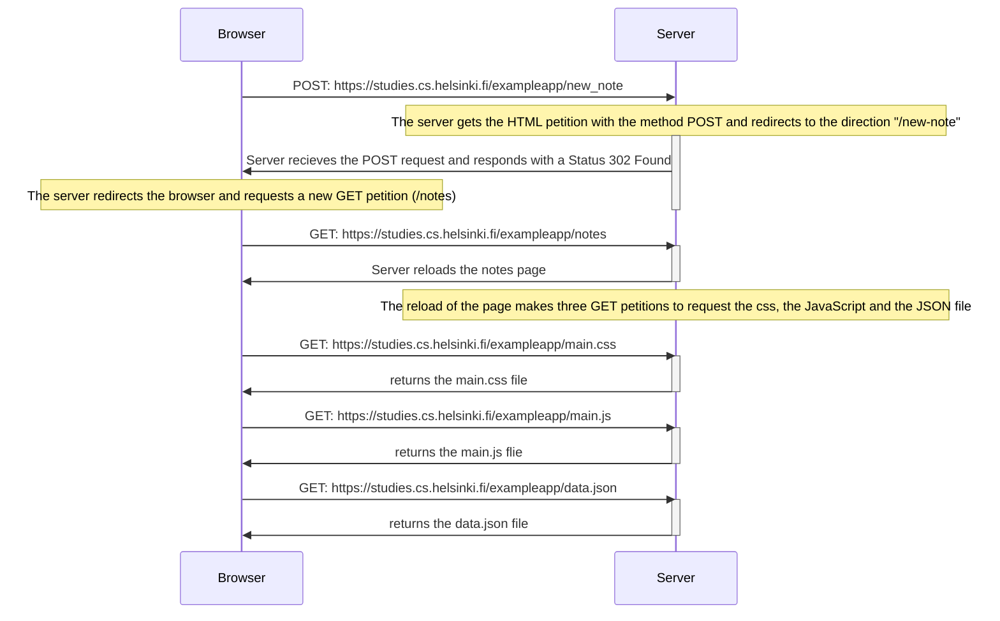

```mermaid
sequenceDiagram
    Browser->>Server: POST: https://studies.cs.helsinki.fi/exampleapp/new_note
    Note over Server: The server gets the HTML petition with the method POST and redirects to the direction "/new-note"
    activate Server
    Server->>Browser: Server recieves the POST request and responds with a Status 302 Found
    Note over Browser: The server redirects the browser and requests a new GET petition (/notes)
    deactivate Server

    Browser->>Server: GET: https://studies.cs.helsinki.fi/exampleapp/notes
    activate Server
    Server->>Browser: Server reloads the notes page
    deactivate Server
    Note over Server: The reload of the page makes three GET petitions to request the css, the JavaScript and the JSON file

    Browser->>Server: GET: https://studies.cs.helsinki.fi/exampleapp/main.css
    activate Server
    Server->>Browser: returns the main.css file
    deactivate Server

    Browser->>Server: GET: https://studies.cs.helsinki.fi/exampleapp/main.js
    activate Server
    Server->>Browser: returns the main.js flie
    deactivate Server

    Browser->>Server: GET: https://studies.cs.helsinki.fi/exampleapp/data.json
    activate Server
    Server->>Browser: returns the data.json file
    deactivate Server
```