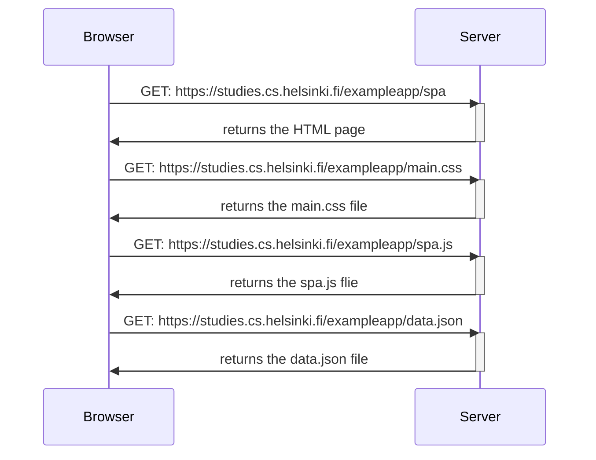

```mermaid
sequenceDiagram
    Browser->>Server: GET: https://studies.cs.helsinki.fi/exampleapp/spa
    activate Server
    Server->>Browser: returns the HTML page
    deactivate Server

    Browser->>Server: GET: https://studies.cs.helsinki.fi/exampleapp/main.css
    activate Server
    Server->>Browser: returns the main.css file
    deactivate Server

    Browser->>Server: GET: https://studies.cs.helsinki.fi/exampleapp/spa.js
    activate Server
    Server->>Browser: returns the spa.js flie
    deactivate Server

    Browser->>Server: GET: https://studies.cs.helsinki.fi/exampleapp/data.json
    activate Server
    Server->>Browser: returns the data.json file
    deactivate Server

```