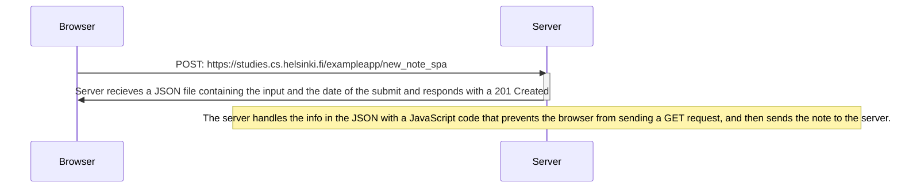

```mermaid
sequenceDiagram
    Browser->>Server: POST: https://studies.cs.helsinki.fi/exampleapp/new_note_spa
    activate Server
    Server->>Browser: Server recieves a JSON file containing the input and the date of the submit and responds with a 201 Created
    deactivate Server

    Note over Server: The server handles the info in the JSON with a JavaScript code that prevents the browser from sending a GET request, and then sends the note to the server.

```